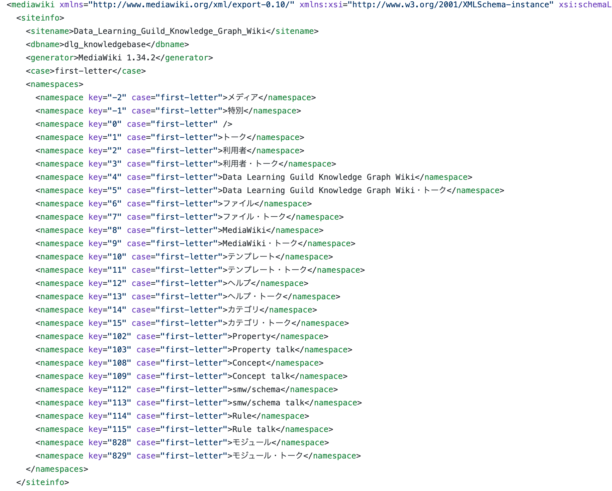
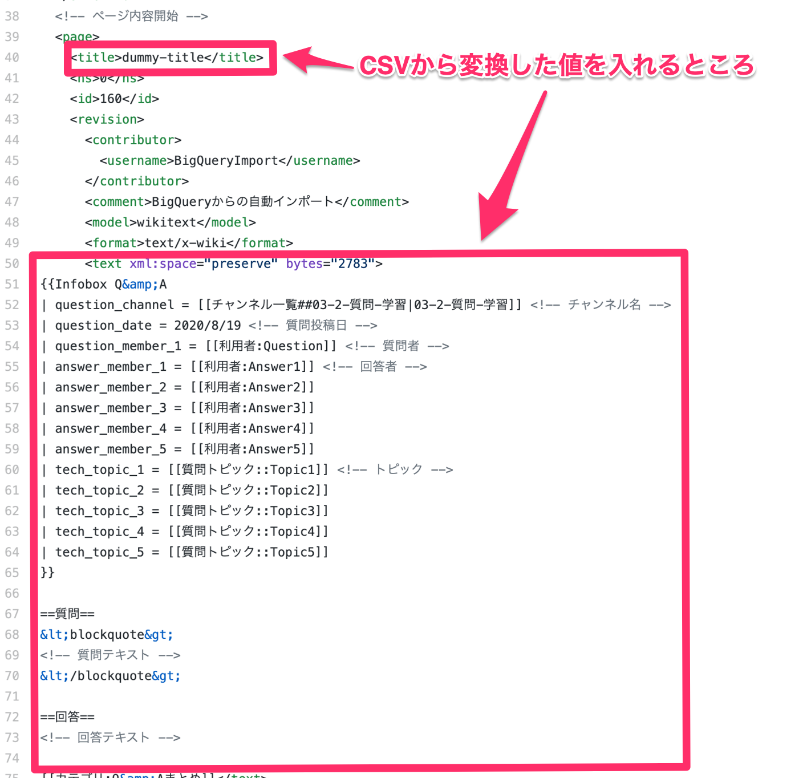

# 詳細設計書
## クラス設計
### PageDataContainerClass
#### 概要
出力xmlを作成する前段階として、ページごとに必要なデータを格納するクラス

#### メンバ
|name|type|default|description|
|----|----|-------|-----------|
|id|int|0|ページタイトルに使用するindex|
|title|string|Null|ページのタイトル。title_idxから"Q&A-xxxx"を設定|
|question_channel|string|Null|質問したチャンネル名|
|question_date|date|Null|質問した日付|
|question_members|tuple|質問したメンバーの表示名のタプル|
|answer_members|tuple|回答したメンバーの表示名のタプル|
|tech_topics|tuple|会話の中から単語リストに該当する単語のタプル。出現順位順。|
|question_contents|tuple|質問本文|
|answer_contents|tuple|回答本文|

#### メソッド
- 下記、処理フローを参考に必要に応じて追加

## グローバル変数
1. 各種ファイル名
1. user_master
    - メンション変換用dict
1. annotation_master
    - メンション変換用dict
1. output_template
    - 出力xmlのテンプレート
1. containers_list
    - PageDataContainerを格納するリスト
1. output_dict_list
    - 出力dictを格納するリスト
1. num_of_pages_in_xml
    - 1xmlファイルあたりのページ数

## 処理フロー
### メイン関数
#### 引数
1. 入力csvファイル名
2. 入力テンプレxmlファイル名
3. 出力先xmlフォルダパス

#### 処理
1. df_talk = pd.read_csv **# csvデータ読み込み**
1. `setup()` **# 各種マスタの設定**
1. thread_ts_list = pd.unique(thread_ts).tolist() **# thread_tsの一覧取得**
1. for i, t in enumerate(thread_ts_list): **# thread_ts種類ごとにfor loop**
    1. df_tmp = df_talk[df.thread_ts == t] **# thread_tsを取得**
    1. c = `df_to_container(df_tmp, i)` **# dfのデータをPageDataContainerへ変換**
    1. containers_list.append(c)
1. for i in range(0, len(thread_ts_list), num_of_pages_ix_xml) **# num_of_pagesごとに、index数値を取得**
    1. tmp_container_list = 1xmlファイル分のPageDataContainer
    1. dict_tmp = `container_to_dict(tmp_container_list, output_template, user_master, annotation_master)` **# PageDataContainerを辞書型へ変換**
    1. output_dict_list.append(dict_tmp) **# 作成した辞書をグローバル変数へ格納**
1. for d in output_dict_list: **# 格納しておいたアウトプット辞書を１つずつ取り出し**
    1. `dict_to_xml(d)` **# 辞書をxmlへ出力**

---

### setupメソッド
#### 処理
- 各種マスタデータの読み込み・格納

1. user_master = `create_user_master(pd.read_csv)` **メンション変換用dictの作成**
1. annotation_master = `create_annotation_master(pd.read_csv)` **アノテーション変換用dictの作成**
1. output_template = read_xml　**# xmlテンプレ読み込み（辞書型）**

---

### create_user_masterメソッド
#### 引数
- ユーザマスタのdf
### 返り値
- メンション変換用dict
  - Key: (user_id, target_date) **# 日付ごとにユーザ表示名が変わるため、user_id+target_dateをキーとする**
  - Value: name
### 処理
省略

---

### create_annotetion_dictメソッド
#### 引数
- 単語マスタのdf
### 返り値
- アノテーション変換用dict
  - Key: アノテーショントリガーの単語
  - Value: プロパティ名
### 処理
省略

---

### df_to_containerメソッド
#### 引数
- 入力csvのdf（1スレッド分）
- スレッドのindex
#### 返り値
- 1スレッド分のPageDataContainerClass
#### 処理
- PageDataContainerClassオブジェクトの初期化
- df内の各データを該当するメンバに割当
- 必要に応じてクラスメソッドへ処理を切り分け

---

### container_to_dictメソッド
#### 引数
- 1xmlファイル分のPageDataContainerClass
- テンプレートxmlのdict
- メンション変換用dict
- アノテーション用dict
#### 返り値
- 1スレッド分の出力dict
#### 処理
- PageDataContainerClassオブジェクトをもとに出力xmlのもととなるdictの作成
- テンプレートdictをコピー
- xmlに必要なテキストデータの整形→dictへ格納
    - `<title>` : titleメンバ
    - `<text>`
        - Infoboxの記述
        - 質問（`==質問==`）、回答（`==回答x==`）のヘッダー付け
        - 質問内容・回答内容の記述
        - メンションのuser_id変換
        - アノテーション
- Key名について、要調査事項を参照

#### 出力xmlフォーマットイメージ
- 下記イメージの`<mediawiki></mediawiki>`全体を出力

---

### dict_to_xmlメソッド
#### 引数
- xml出力用dict
#### 処理
- dictオブジェクトをxml形式のテキストに変換
- テキストファイルの出力

---

## 要調査事項
- dict -> xmlとする場合、並列する同一タグをどう扱うのか？
  - <page></page>タグが1つのxmlファイルに複数回、同じ階層に現れる
  - しかし、辞書型を使うと'page'キーは１つしか使えない
  - 対処方法を検討する必要あり
    - 仮に['page1'], ['page2']とおいておいて、テキスト出力後に修正…？
  - [valueにリストを使う方法](https://www.haya-programming.com/entry/2018/04/24/002524)
    - シリアライザが対応しているかは要調査

## 検討項目
- df -> ContainerClass -> dict を1つのfor loopでやらずとも、それぞれでfor loopを回しても良い
  - その方が、中間データのContainerClassをグローバル変数として保持できる
- 初期化等は初期化メソッドにまとめても良さそう
- 慣れてくると内包表記にもチャレンジできる！ｗ
